# 50 Ways of Seeing

## Subject of Observation

This is the original object that I chose to observe and reinterpret in 50 different ways.

01 — Connected Structure

I used simple blocks in Figma to show the object’s basic structure, including its irregular shapes and how its individual parts are connected.

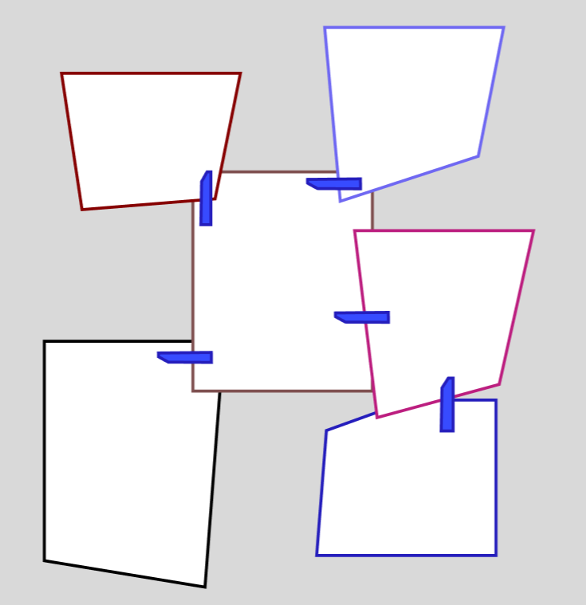

02 — Pixelated Form

I created a pixel drawing in Photoshop using many small squares. I think the appearance of pixel art matches the overall form of the installation.

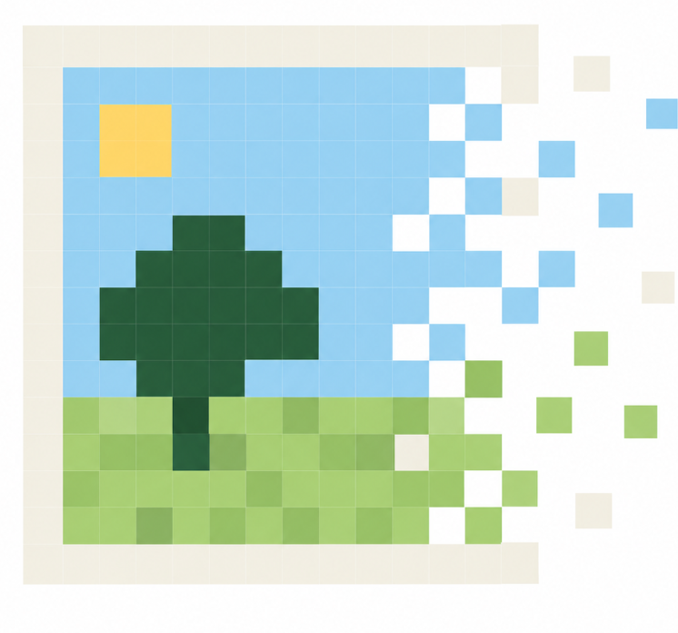

03 — Digital Frame Installation

I created multiple photo frames in Blender and arranged them together to reinterpret the structure of the original installation in three-dimensional space.

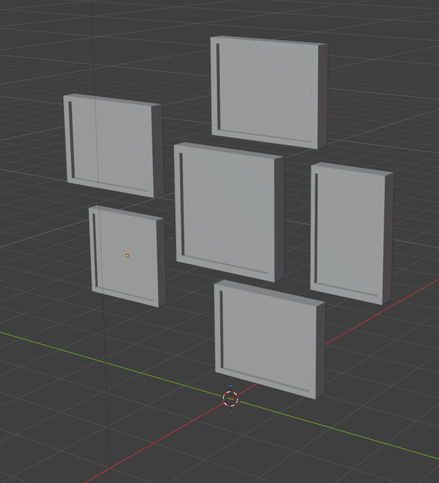

04 — Distorted Perspective

I used Blender to recreate the installation from my viewing angle and represent the distorted shape I observed.

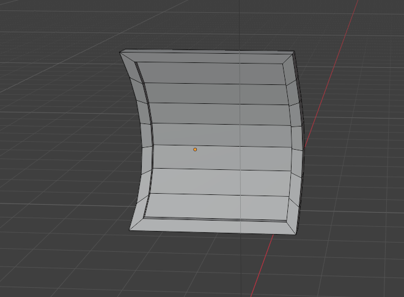

05 — Connected Distortion

I used Blender to create a distorted form and connected its parts using the small metal rings found in the original installation.

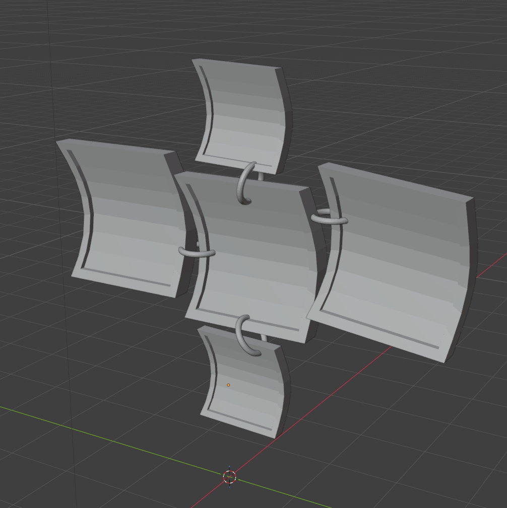

06 — Endless Structure

The installation gave me a sense of infinity, as if I could never finish looking at it. I extended the model into the distance to create the feeling that it has no visible end.

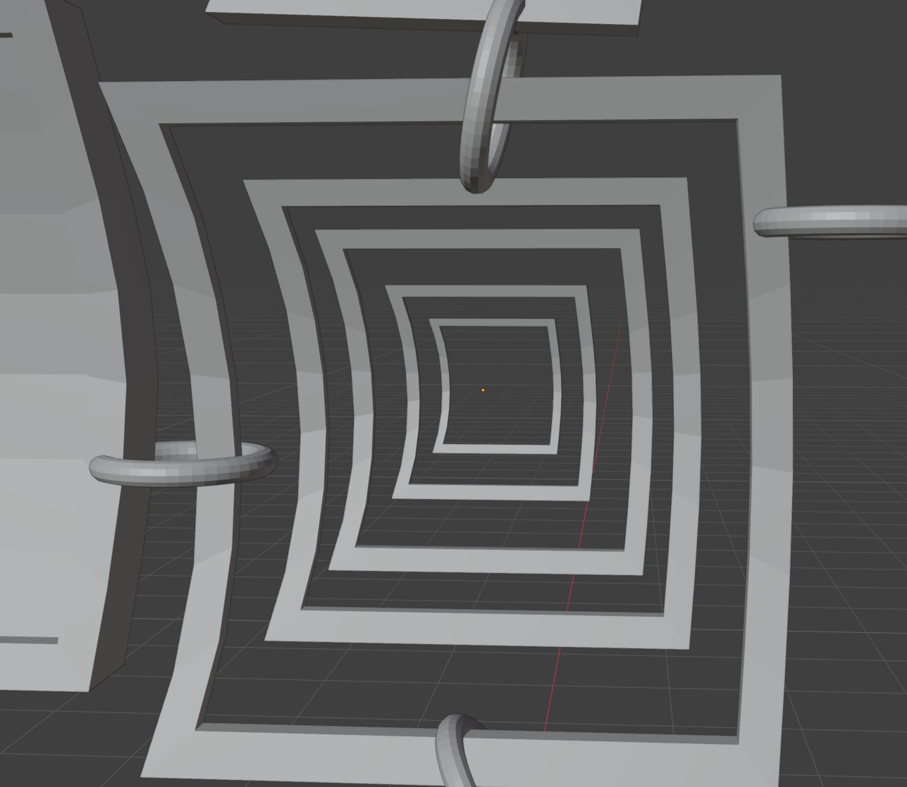

07 — Greener View

I applied a filter to the image and intensify the green tones that I noticed throughout the installation.

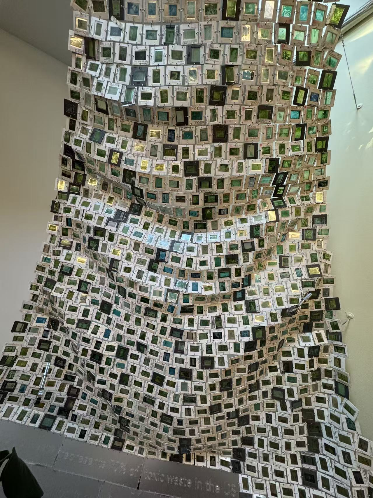

08 — Unusual Stacking

I stacked different photographs together in unusual ways to explore another form of photographic layering.

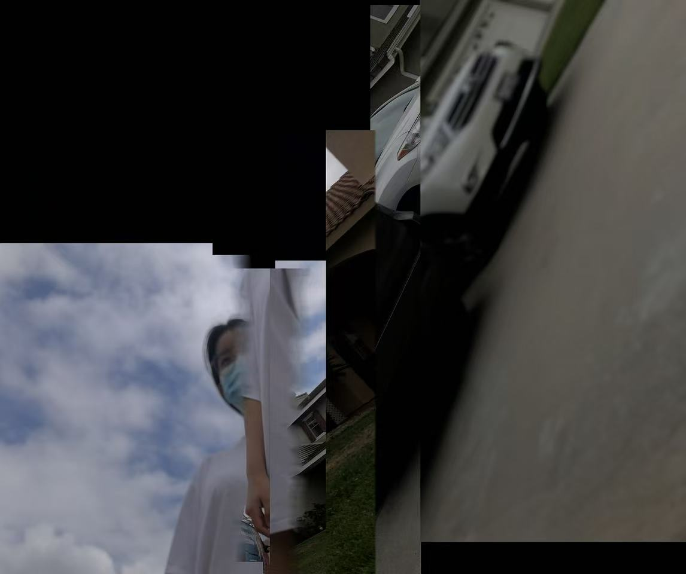

09 — Mysterious Blur

I wrapped a stone in clay to represent the blurred quality of the photographs. I then used red light to create the mysterious feeling that I experienced from the installation.

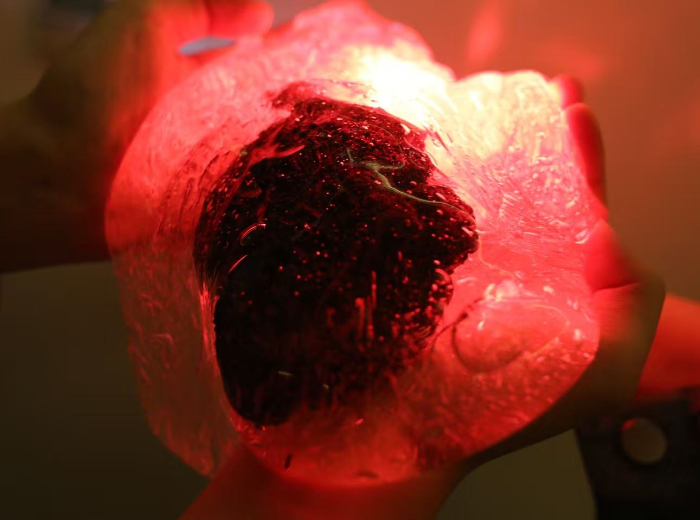

10 — Blue Memory

I used the same clay-covered stone but changed the lighting to blue, which is closer to the original appearance and atmosphere of the installation.

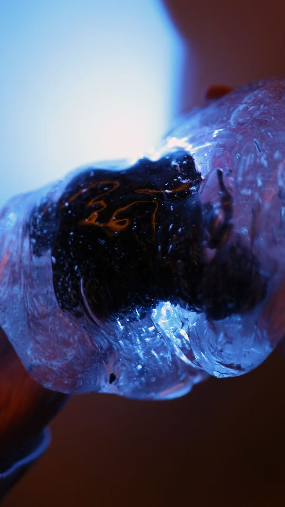

11 — Fragmented Light

I wrapped bubble wrap around a light and photographed it. The texture divided the light into many blurred spots, reflecting the repetition and unclear images in the original installation.

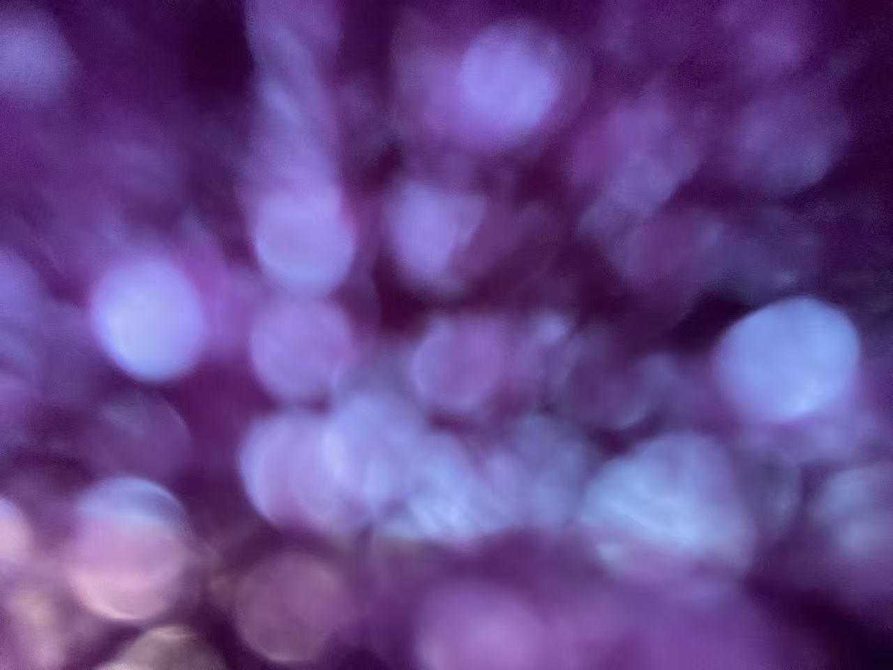

12 — Projected View

While lying in bed, I noticed that the view outside was mysteriously projected onto my wall. Its blurred appearance reminded me of the unclear images in the installation.

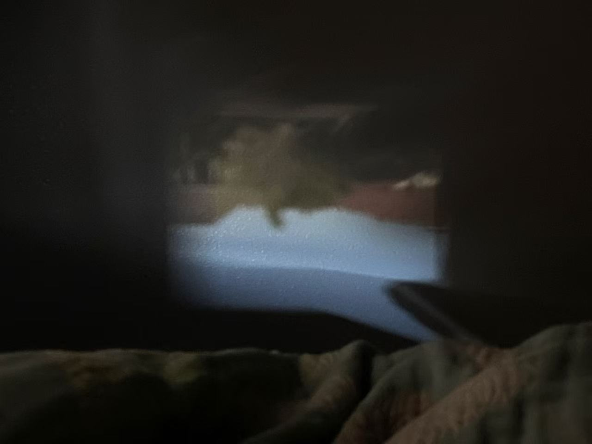

13 — Ink Smell Map

This experiment is related to smell. I noticed that the installation had a strong ink smell, so I stood at different distances to identify which areas smelled stronger. I found that the smell was stronger near the center. Dark green represents a stronger smell, while lighter green represents a weaker smell.

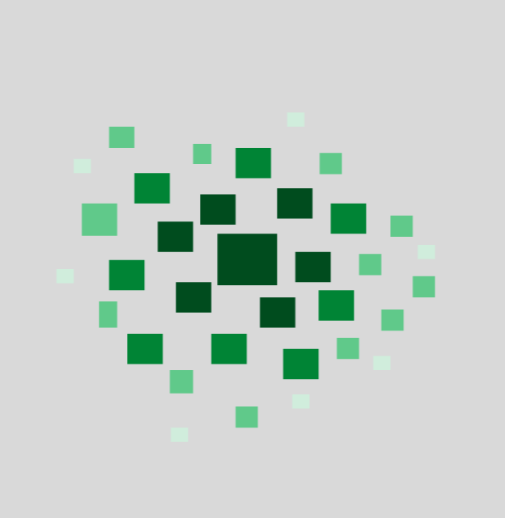

14 — Paper Frame

I used paper cutting to recreate the square frames of the installation.

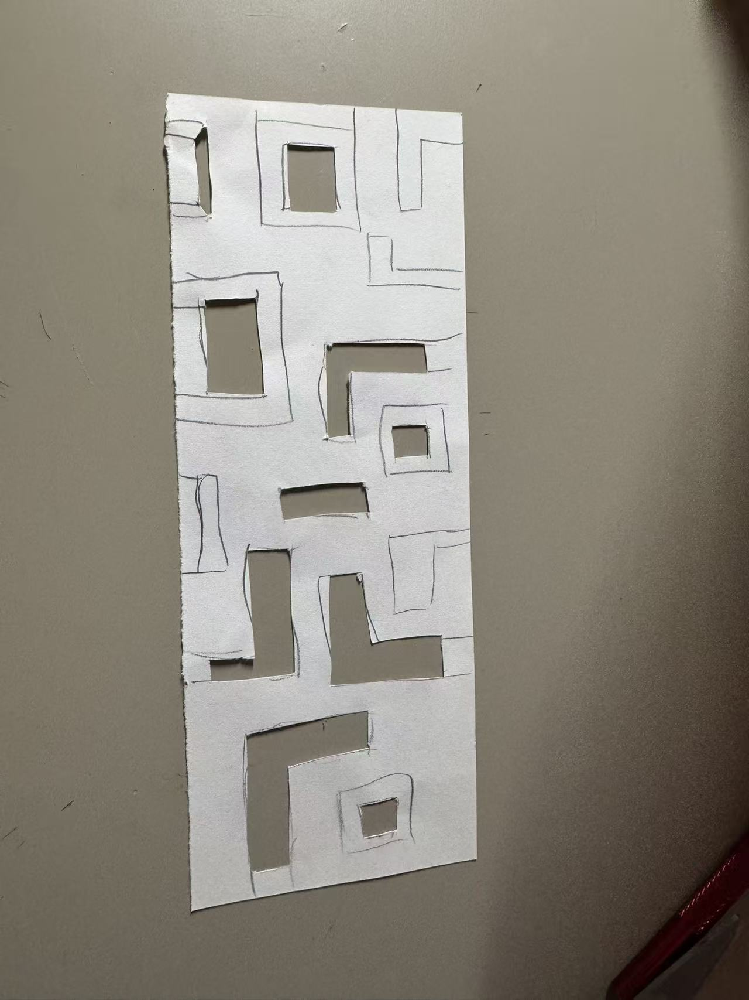

