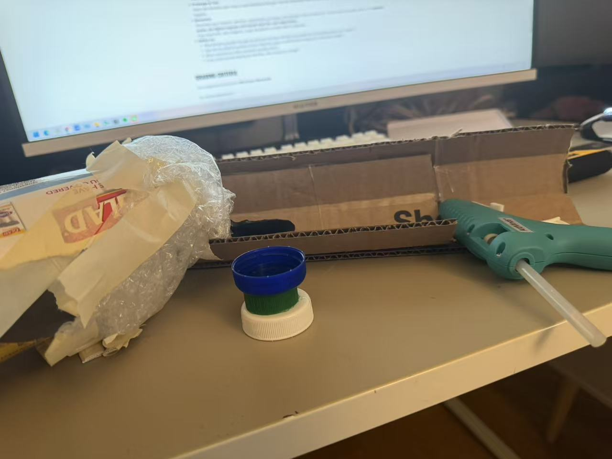
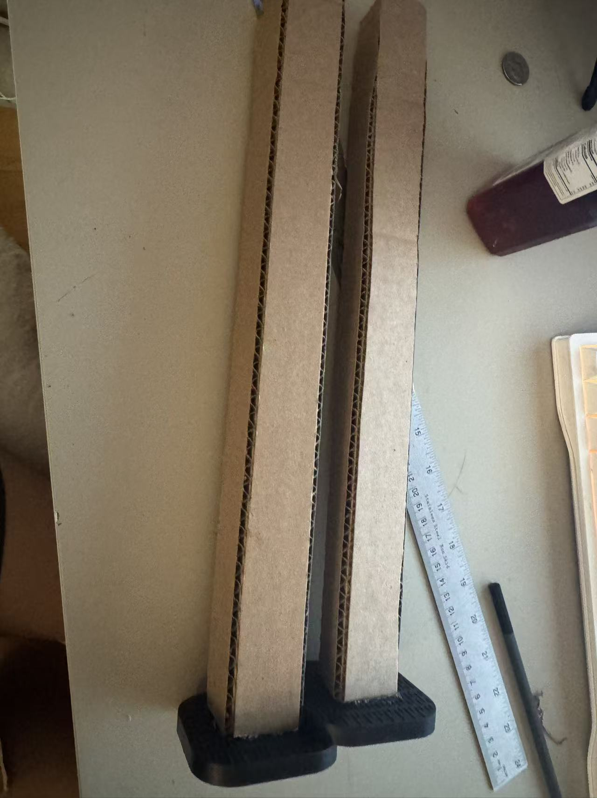
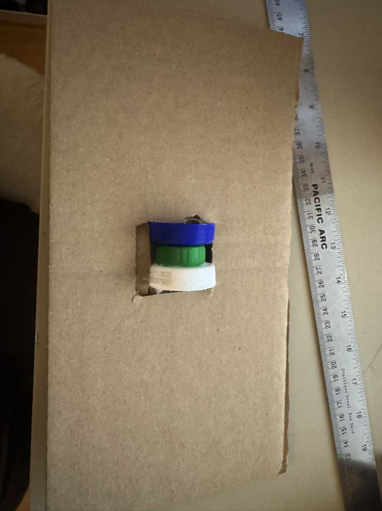
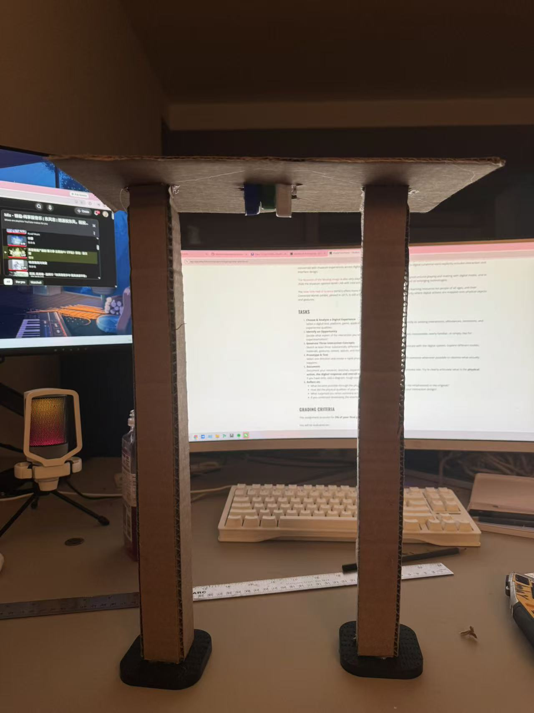
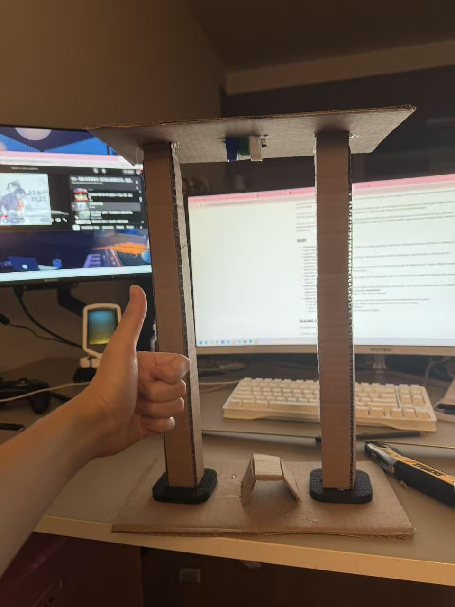
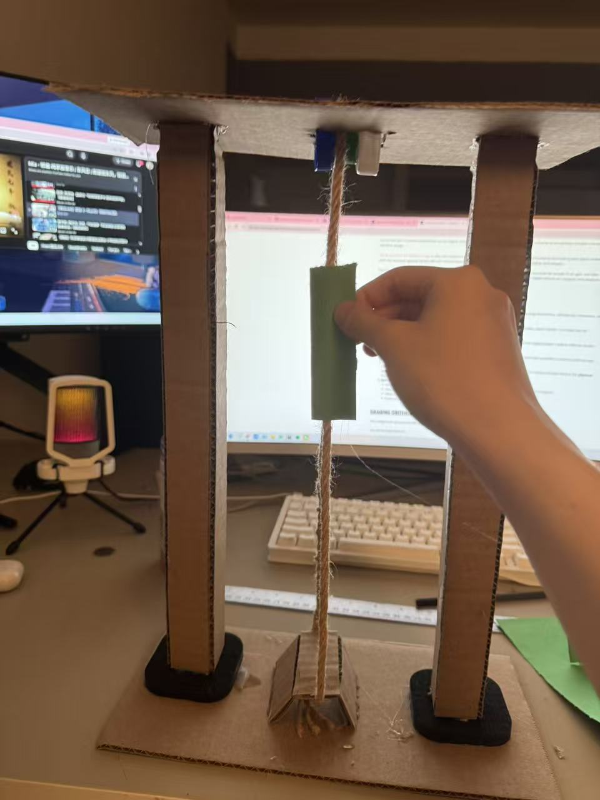

# Interface: Stardew Valley Fishing
*My Steam account is currently being used by someone else, so this image is sourced from the internet.*

### We Need to Talk Letter
You have many things that I really like. I like farming, fighting monsters, collecting things, and slowly building my own farm and life. Most of the time, this game makes me feel relaxed and gives me a sense of accomplishment. But fishing has always been the one part that troubles me the most.

I know you want to imitate the difficulty of fishing in real life, but for me, sometimes it is just too hard to control. I have to carefully control the mouse and keep the green bar moving with the fish. Every time I do this, my heart starts beating faster. The movement is very difficult to control. Sometimes I only move the mouse a little, but the green bar moves too much. Sometimes I feel like there is a slight delay between my mouse movement and what happens on the screen, which makes it hard for me to react in time. Sometimes the green bar even hits the bottom and bounces back up.

The most contradictory part is that I actually still really want to fish. I want to catch different kinds of fish, complete the collection, and when I see a rare fish, I really want to catch it. But every time I actually start fishing, I become very nervous. You are supposed to be a game that helps me relax, but fishing is the one part that makes me suffer.

I do not want fishing to become completely easy. I still want it to require skill, but I hope the challenge does not come from difficult mouse control and tiny movements.

### Three Qualities
-Relaxation / Stress
-Skill / Control Difficulty
-Fishing Experience / Screen Precision

## Three Concepts

### Concept 1: Pulling Fishing Line

Player pulls a rope upward to raise the green fishing bar and releases it to let the bar move down.

**Physical:** Pull and release a rope.  
**Digital:** The green bar moves up when the rope is pulled and moves down when it is released.  

### Concept 2: Body Movement Control

The player raises or lowers their arms, or a fishing-rod-like controller, to control the position of the green bar on the screen.

**Physical:** Raise and lower the arms or rod.  
**Digitale:** The green bar follows the height of the player's arms or the rod position.  

### Concept 3: Elastic Resistance

The player pulls an elastic band or stretchable material, and different fish create different levels of resistance.

**Physical:** Pull against an elastic material with different levels of tension.  
**Digital:** Pulling harder raises the catch bar, while stronger fish create more resistance.  

## Chosen Direction

I decided to combine Concept 1 and Concept 3。

I kept the idea of physically pulling a rope. From Concept 3, I kept the idea of creating tension and resistance through the material.

My final idea is to build a pulley-based physical controller. The player will manually pull a rope to control the green fishing bar on the screen. 
## Prototype Process

### Step 1: Materials

For the first step, I prepared the main materials for the prototype. I used cardboard for the structure, twine for the fishing line, and a bottle cap as the pulley.

### Step 2: Building the Supports

I made two cardboard supports for the pulley. I also added two plastic bases to the bottom of the supports to help keep them balanced and stable.

### Step 3: Making the Pulley

I used three bottle caps, two large ones and one small one, to make a simple pulley. I attached the pulley to the top cardboard support so the rope could slide through it more smoothly.

### Step 4: Assembling the Structure

I attached the top pulley section to the two cardboard supports and fixed them together. Next I plan to add a piece at the bottom to secure the rope and keep it in place.

### Step 5: Adding the Bottom Rope Guide

I added a small cardboard guide at the bottom of the structure. The rope can pass through it and form a loop and keep the rope in place and allows it to move continuously through the pulley system.

I was really excited to finally put the rope on and test how it moves.

## Final Result

I added the rope to the structure, and the rope can now be pulled through the pulley system. I also attached a green bar to the rope as the part that the player can manually control.

By pulling the rope, i can move the green bar up and down, similar to controlling the fishing bar in the game.

