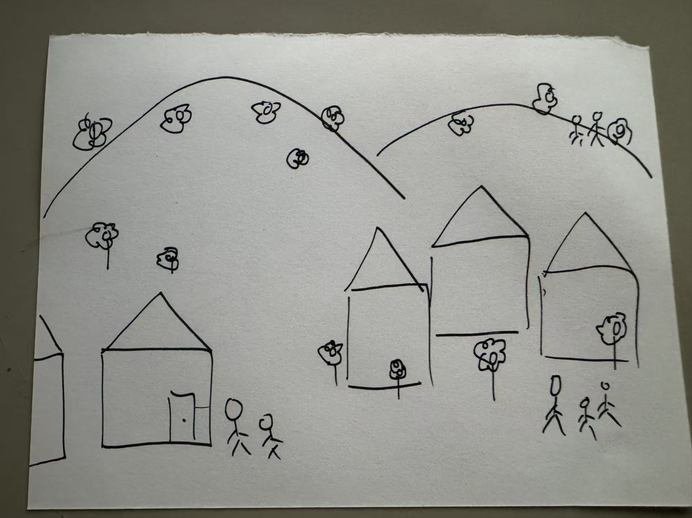
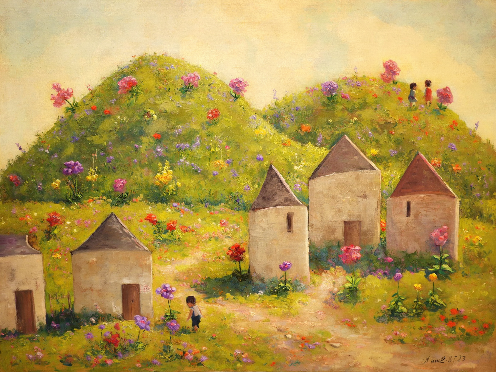
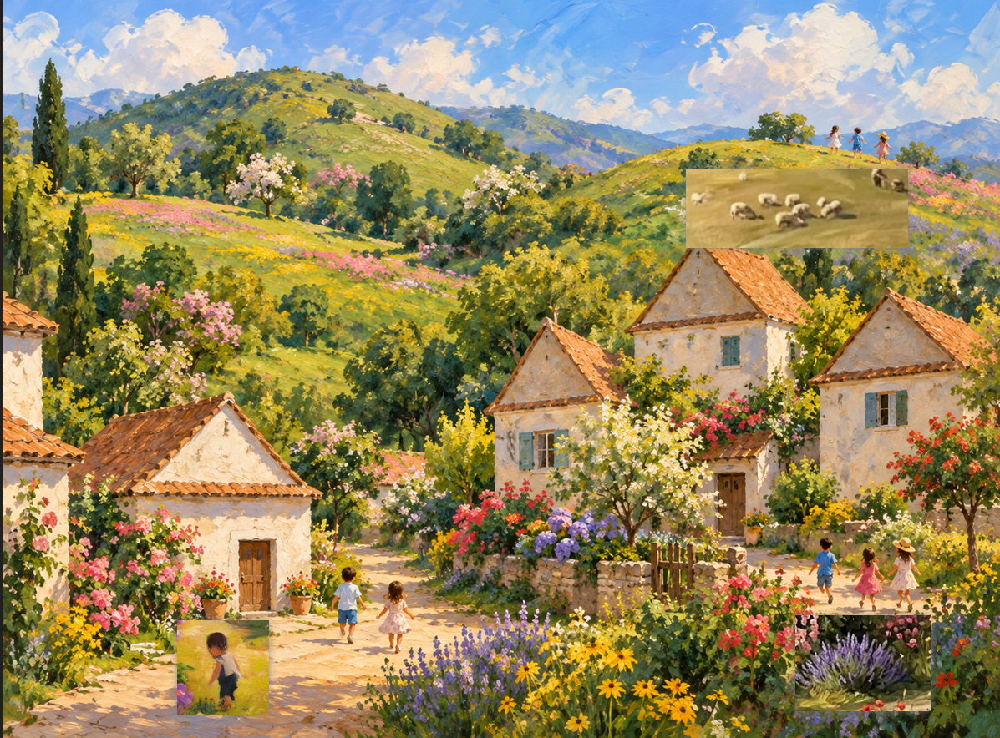

# GenAI as Creative Material

## The Artist’s Garden at Vétheuil

## 1. Artwork Information

- **Title:** *The Artist’s Garden at Vétheuil*
- **Artist:** Claude Monet, French painter, 1840–1926
- **Year:** 1881
- **Medium:** Oil on canvas

## 2. Background

This painting depicts the garden of the house Monet rented in Vétheuil, France. He arranged with the landlord to landscape the terraces leading down to the Seine. The young boy in the painting is his son, and other members of his household appear on the steps.

## 3. Materials and Visual Qualities

This oil painting has rich layers of paint. The path in the center of the garden guides the viewer’s eye toward the steps and the house. The tall sunflowers contrast in scale with the small figures. The bright colors make the sunlit garden feel rich and lively.

## 4. I love it because

I made a copy of this painting when I was learning oil painting. I like its bright sunlight, the flowers, and its countryside atmosphere. Looking at it makes me feel relaxed and refreshed.

## 5. Visual Analysis and Creative Direction

The qualities that interest me most are the bright sunlight, rich colors, flowers, children, and the quiet, comfortable countryside atmosphere. I want to keep these qualities, but include different kinds of flowers rather than only sunflowers.

## 6. Text Prompt

A horizontal oil painting of a peaceful countryside village in bright, warm sunlight. Follow the attached sketch: rolling hills stretch across the background, several houses with triangular roofs sit in the foreground and middle ground, and small groups of children appear near the houses and on the distant hillside. Different kinds of flowers grow among the houses and across the hills, including pink, purple, yellow, and red flowers surrounded by lush greenery. Keep the figures small compared with the landscape. Use rich colors, soft shadows, and visible, loose oil-painting brushstrokes. Create a quiet, comfortable countryside atmosphere. Do not include black sketch outlines, stick figures, or text labels in the final painting.

## 7. Composition Sketch

my sketch:)

## 8. First-Round AI Outputs

### ChatGPT

### Gemini / Nano Banana

### Ideogram

## 9. First-Round Reflection

I like everything in the ChatGPT image, including the small houses, flowers, and rolling hills. It captures the bright, peaceful countryside atmosphere I wanted. In the Gemini image, I like the flock of sheep in the distance and would like to bring that detail into the ChatGPT image. There is nothing in the Ideogram image that I particularly like or want to use.

## 11. Second-Round AI Outputs

### ChatGPT — Round 2

### Gemini / Nano Banana — Round 2

### Ideogram — Round 2

